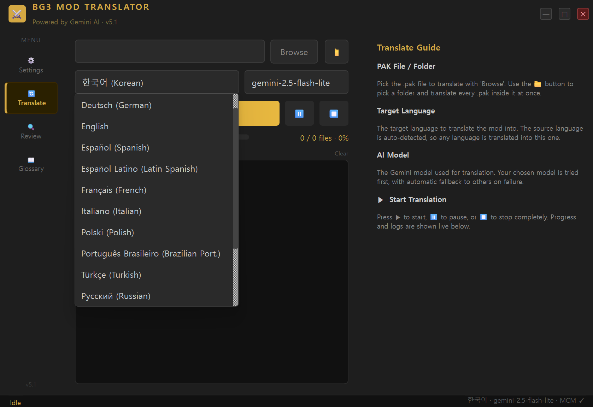
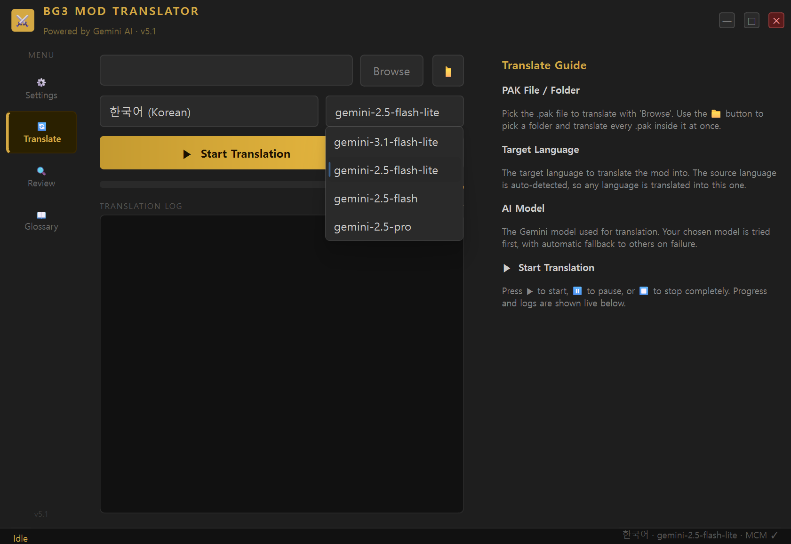
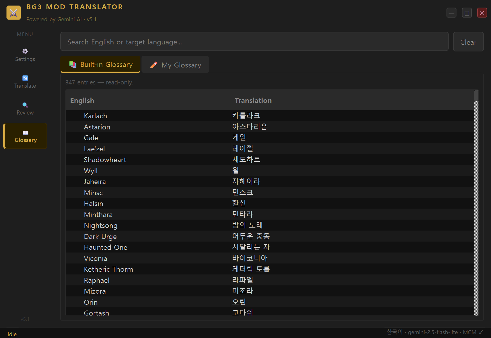
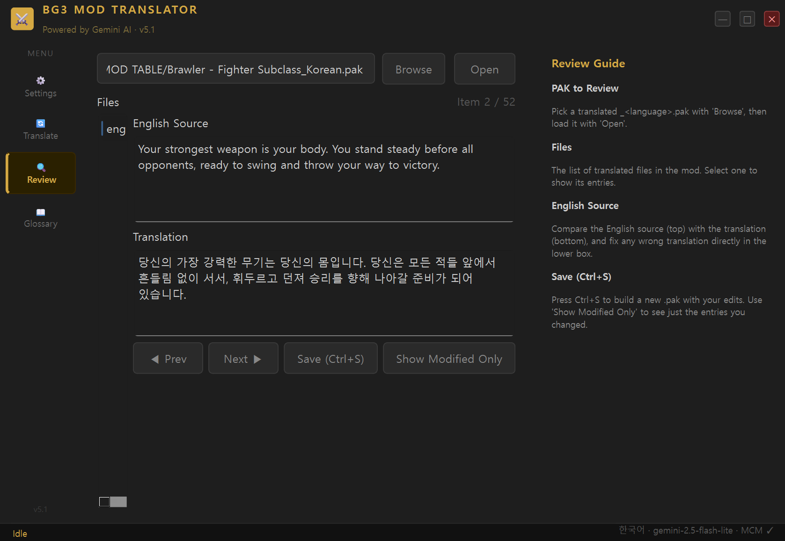

[한국어](README.md) | **English**

# BG3 Mod Translator v6.0

A tool that automatically translates text in Baldur's Gate 3 mods using Google Gemini AI.
Translate a mod **from any language into any of 15 target languages including Korean**, right out of the box with **a single EXE file** — no installation required.

> ### 🆕 What's new in v6.0
> - 🌍 **App UI in 15 languages** — auto-detects your game's language and matches both the target and UI
> - 📖 **Official language-pack reference** — reuses your game's official translations for consistent terms and fewer API calls
> - 📋 **Table-based Review tab** + ✏️ **inline glossary editing** — review and edit many entries at a glance
> - 🚀 **First-run setup wizard** + 🗂️ **BG3 install-folder auto-detection**

> ### 🌍 True Any-to-Any Translation (v5.1)
> This is not just an "English → Korean" tool. **Whatever language the source is** (English, Russian, Chinese, Polish, etc.), it is auto-detected and translated into **any of the 15 target languages**.
>
> - Russian mod → **English**
> - Polish mod → **Korean**
> - English mod → **Japanese**
>
> Any source → any target combination works, and **English is now selectable as a target** too. Just change `Translation Target Language` in the Translate tab.



> The **Translation Target Language** dropdown in the Translate tab. Pick any of 15 languages, from Korean to Japanese.

---

## ⚠️ Important — Output is for personal use only

This tool unpacks the original mod (`.pak`), adds translations, and **repacks the whole thing.** As a result, the output `.pak` **contains the original author's assets and scripts.**

- ✅ Use it freely for **your own personal play**.
- ❌ **Do NOT upload or redistribute** the output `.pak` to Nexus or any other site **without the original author's explicit permission.** Doing so violates the original author's rights and Nexus rules, and can lead to suspension or an account ban.
- If you want to share a translation, **get the original author's permission first.**

---

## ⬇️ Download the GUI Version

> **An EXE version you can use immediately without installing Python.**

### 👉 [Download BG3_ModTranslator.exe](https://github.com/anboyu-alt/BG3-Auto-Korean/releases/latest)

Click `BG3_ModTranslator.exe` on the Releases page to download instantly.

---

## Table of Contents

1. [Prerequisites](#prerequisites)
2. [Download](#download)
3. [First Launch — Configuration](#first-launch--configuration)
4. [Translating](#translating)
5. [Managing the Glossary](#managing-the-glossary)
6. [Reviewing Translations](#reviewing-translations)
7. [Applying Translations to the Game](#applying-translations-to-the-game)
8. [Troubleshooting](#troubleshooting)
9. [FAQ](#faq)
10. [How It Works](#how-it-works)

---

## Prerequisites

Before running the EXE file, please prepare the following 3 items.

### 1. Get a Gemini API Key (Free)

Required for Google AI to perform translations. Obtaining a key is free.

1. Go to [aistudio.google.com](https://aistudio.google.com) (sign in with a Google account)
2. Click **"Get API key"** in the left menu
3. Click the **"Create API key"** button
4. Copy the generated key (a long string starting with `AIzaSy...`) and save it in a text file

> ⚠️ Never share your API key with anyone. API usage will be billed to your account.

---

### 2. Download LSLib (ExportTool)

A tool needed to unpack and repack `.pak` files.

1. Go to [github.com/Norbyte/lslib/releases](https://github.com/Norbyte/lslib/releases)
2. Click the latest version's **`ExportTool-vX.X.X.zip`** to download
3. Extract the downloaded `.zip` file
4. After extraction, the file structure will look like this:
   ```
   ExportTool-v1.20.4/
   └── Packed/
       └── Tools/
           └── Divine.exe   ← You will enter the path to this file later
   ```

> Example path: `C:\ExportTool-v1.20.4\Packed\Tools\Divine.exe`

---

### 3. Install .NET 8.0 Runtime

Required to run `Divine.exe`. Skip this if it is already installed.

1. Go to [dotnet.microsoft.com/en-us/download/dotnet/8.0](https://dotnet.microsoft.com/ko-kr/download/dotnet/8.0)
2. Under **".NET Desktop Runtime"**, click **"x64"** to download the installer
3. Run the installer and follow the prompts

---

## Download

1. Go to the **[Releases](../../releases)** page of this repository
2. Under **Assets** of the latest release, click `BG3_ModTranslator.exe` to download
3. Save the file to any folder you like (the location does not matter)

> **If a Windows security warning appears:** Click "More info" → "Run anyway".
> This warning appears because the file lacks a code-signing certificate; it is not actually dangerous.

---

## First Launch — Configuration

Double-click `BG3_ModTranslator.exe` to run it.

On first launch, a sidebar navigation screen with a dark amber theme will appear.
Click **"Settings"** in the left sidebar.

> 📌 **The values already shown in the input fields in screenshots are just examples.**
> You must enter your own values for the API key, Divine.exe path, and cache file path.

### ① Enter Your Gemini API Key

Paste the API key you obtained during the prerequisites step into the `Gemini API Key` field.

- It is hidden as `****` by default for security
- Click the **"Show"** button to view what you have entered

### ② Enter the Divine.exe Path

Click the **"Browse"** button to the right of the `Divine.exe Path` field.
When the file picker opens, navigate to the folder where you extracted LSLib and select `Divine.exe`.

> Example: `C:\ExportTool-v1.20.4\Packed\Tools\Divine.exe`

> 💡 **The target language and AI model are chosen in the "Translate" tab** — they are not in Settings. (See [Translating](#translating))

### ③ Select App UI Language

Under `App UI Language`, choose the interface language for the program (Korean / English). This is the program's display language, not the translation output language, and it takes effect after a **restart**.

### ④ UI Scale (Optional)

`UI Scale` controls on-screen text and button size. If everything looks tiny on a high-res (4K) monitor, raise it to `1.25`–`2.0`; `auto` follows your monitor's DPI. Takes effect after a restart.

### ⑤ Translation Cache File Path (Optional)

The translation cache is a file that stores text you have already translated.

- **Leave it blank and a cache file will be created automatically in the default location. Leave it blank unless you have a specific reason to change it.**
- Default location: `C:\Users\<username>\AppData\Roaming\BG3-Mod-Translator\translation_cache.json`
- When this file exists, the same text will be retrieved from the cache instead of calling the API again → **Faster translation + lower API usage**
- **Never delete this file.** Deleting it causes all previously translated content to be forgotten and retranslated from scratch.

### ⑥ Save

Click the **"Save"** button.

> 💾 **Once saved, your API key and paths will be loaded automatically on the next launch.**
> You only need to enter them once.

After saving, click the **"Test Connection"** button to verify that your settings are correct.

---

## Translating

Click **"Translate"** in the left sidebar. The **right side always shows a description** of each item — handy if it's your first time. (Drag the middle handle to resize the description area.)

### Translation Steps

**Step 1 — Select a PAK File or Folder**

- **Single file**: Click **"Browse"** to the right of the `PAK File/Folder` field and select the `.pak` file to translate
- **Multiple files**: Type a **folder path** containing the `.pak` files directly, and all `.pak` files in the folder will be translated at once

> Mods are usually downloaded as `.zip` archives containing `.pak` files inside.
> Extract the `.zip` first, then select the `.pak` file.

**Step 2 — Select the Target Language**

In the left combo box, pick the language to translate the mod into. The source language is auto-detected, so **a mod in any language** is translated into the one you pick.

> Supported languages (15 total): Korean (default), English, Japanese, French, German, Spanish, Latin Spanish, Italian, Polish, Russian, Ukrainian, Turkish, Brazilian Portuguese, Chinese (Simplified), Chinese (Traditional)

**Step 3 — Select the AI Model**

In the right combo box, pick the Gemini model to use. Your chosen model is tried first, with automatic fallback to others on failure. If unsure, leave the default.



> 💡 The target language and AI model you pick here are **saved automatically** and kept for next time.

**Step 4 — Start**

Click the **"▶ Start"** button.

Once translation begins:
- The progress bar fills in order: `📤 Unpack` → `🔄 Translate` → `📥 Repack`
- You can watch progress in real time in the log window
- When translation is complete, a **`_<language>.pak`** file is created in the same folder as the original `.pak` (e.g., `_Korean.pak`, `_Japanese.pak`)

**Controls during translation:**

| Button | Action |
|---|---|
| ⏸ Pause | Pauses translation. Click again to resume. |
| ⏹ Stop | Stops translation completely. |

> **Translation time:** Varies by the amount of text in the mod. Small mods take a few minutes; large mods may take tens of minutes.

> **Translation cache:** Translated text is saved automatically. If the same text appears in another mod, it is pulled from the cache without an API call, making it faster. Never delete the cache file.

---

## Managing the Glossary

Click **"Glossary"** in the left sidebar.



The glossary is a list of proper terms the AI must follow when translating. For example, it forces "Karlach" to always be translated as "카를라크" (in Korean), and "Charisma" to always be translated as "매력".

### 📚 Default Glossary Tab

Contains 347 built-in BG3-specific terms (character names, ability scores, spell names, races, classes, status effects, etc.).
Read-only. Type English or the target language in the search bar at the top to filter instantly.

### ✏️ My Glossary Tab

You can add and manage custom proper nouns specific to a mod.

| Button | Action |
|---|---|
| + Add | Add a new English → translation entry |
| Edit | Edit the translation of the selected entry (or double-click) |
| Delete | Delete the selected entry |
| 💾 Save | Save changes |

> ℹ️ **My Glossary takes priority over the Default Glossary.** If you want a word from the Default Glossary to be translated differently, add the same English word to My Glossary.

> My Glossary is saved at `C:\Users\<username>\AppData\Roaming\BG3-Mod-Translator\custom_glossary.json`.

---

## Reviewing Translations

AI translations may contain errors. In the Review tab, you can compare the original English text and the translation side by side, and edit directly.

Click **"Review"** in the left sidebar.



### Review Steps

**Step 1 — Select a PAK File to Review**

In the `PAK to Review` field, click **"Browse"** and select the completed `_<language>.pak` file.

**Step 2 — Open**

Click the **"Open"** button. The file is analyzed automatically.

**Step 3 — Review Entries**

- Select a file from the **file list** on the left
- Compare the **"Original English"** text above with the **"Translation"** below
- If the translation is wrong, edit the translation box directly

**Step 4 — Save**

Click **"Save (Ctrl+S)"** to generate a new `.pak` file reflecting your edits.

**Review screen controls:**

| Button / Shortcut | Action |
|---|---|
| ◀ Prev / Next ▶ | Navigate to the previous/next translation entry |
| Save (Ctrl+S) | Save edits and generate a new `.pak` |
| Show edited only | Filter to show only entries you have modified |

---

## Applying Translations to the Game

When translation is complete, a **`<ModName>_<language>.pak`** file is created in the same folder as the original `.pak`.

```
Downloads/
├── SomeMod.pak            ← Original (unchanged)
└── SomeMod_Korean.pak     ← Translated mod ✅
```

Install this `_<language>.pak` file using your BG3 mod manager.

**When using BG3 Mod Manager:**
1. Drag **only** `SomeMod_Korean.pak` into the mod manager or import it via "Import Mod"
2. Do **not** add the original mod (`SomeMod.pak`) to the mod manager (the translated PAK already contains all original content)
3. In-game, change the language setting to the target translation language

> ⚠️ **Always register only the PAK with `_<language>` in its filename.**
> If you register both the original `.pak` and the translated `.pak`, the same mod will be duplicated, causing conflicts or preventing the translation from applying correctly.
> The translated `.pak` this tool creates is a **standalone, complete mod** — it includes everything from the original plus the translation.

---

## Troubleshooting

### The program won't launch

- If blocked by Windows Defender: right-click the file → "Properties" → check "Unblock" → OK
- Or, in the "Windows protected your PC" dialog, click "More info" → "Run anyway"

### "Cannot find Divine.exe" error

- Check that the Divine.exe path in the Settings tab is correct
- Example path: `C:\ExportTool-v1.20.4\Packed\Tools\Divine.exe`
- Re-download LSLib, re-extract it, and set the path again

### Error when running Divine.exe

- Check that .NET 8.0 Desktop Runtime is installed
- Reinstall from [dotnet.microsoft.com/en-us/download/dotnet/8.0](https://dotnet.microsoft.com/ko-kr/download/dotnet/8.0)

### "429 rate limit" message appears

- This is the per-minute request limit for the Gemini free plan
- The script automatically waits and retries, so just wait
- If it happens repeatedly, try changing the AI model in the Settings tab

### Translation finished but the `_<language>.pak` file is missing

- Check the log window for error messages
- If you see "No translatable Localization found or already complete," the mod has no translatable text
- If a translated PAK already exists, it is skipped automatically. Delete the existing file and try again.

### The translated mod behaves strangely or causes conflicts

- Confirm you have **not** added both the original `.pak` and the translated `.pak` to the mod manager
- Keep only the translated PAK active and remove or disable the original `.pak` in the mod manager
- The translated PAK includes all original content, so registering both duplicates the mod and causes conflicts

### The GUI text is too small or cut off (high-resolution monitors)

- On 4K and other high-DPI monitors, the default text can appear small
- Go to **Settings tab** → **UI Scale (Font Size)** combo box → select `125%` ~ `200%`, then save
- Restart the program and text/buttons will be scaled up proportionally
- Choose the `Auto (Monitor DPI)` option to follow Windows display scaling settings

### The game still shows the original text after installing the translation

Things to check:

1. **Game language not changed**: Make sure you changed the in-game language setting to the target translation language.
2. **Both original PAK and translated PAK active at the same time**: The translated PAK is a **standalone complete mod** that includes all original mod content. If you register both the original `.pak` and the translated `.pak` in BG3 Mod Manager, they share the same UUID and the translation may not appear. Disable or move the original `.pak` to another folder and activate only the translated `.pak`.
3. **Mod manager cache**: If you are using BG3 Mod Manager, try "Refresh" on the mod list or Save Order, then fully close the game and relaunch it.

### MCM (settings menu) text still shows in the original language

Automatic processing for MCM-dependent mods was added in v3.5. If you still see some original text:

1. **Check that "Auto-process MCM-dependent mods" is ON in the Settings tab** (default: ON)
2. **Rebuild the output PAK**: If a translated PAK made with an older version remains in the mod folder, the original text may persist. Delete it from the mod folder and working folder, then reprocess.
3. **Combo box options are in English**: Short words like `All`, `Vanilla`, `Hidden` are often used as client/server comparison keys and are intentionally excluded from auto-processing for safety. Their locations are listed in `<modname>_mcm_review.json` next to the output PAK; you can manually refine them if needed.
4. **Items in the review queue report** (`<modname>_mcm_review.json`) are intentionally left in the original language (to preserve game functionality).

### Item/class names show as "Not Found"

This was an issue with translations made using older versions (v3.6/v3.7). The game reads mod localization from **`.loca` binary files**, but those versions did not generate `.loca` files, so the game could not read the text. The current version automatically includes `.loca` files in both translation and review outputs. Re-translating the mod will fix the issue.

### Translation quality is poor

- You can edit translations directly in the Review tab
- Adding proper noun translations to **"My Glossary"** in the Glossary tab will improve translation quality

---

## FAQ

**Q. Will translating modify my original mod files?**
No. The original `.pak` file is never modified. A new translated `.pak` file is created separately.

**Q. Does using the API cost money?**
The Gemini API free plan is sufficient for most use cases. However, translating many large mods may exceed the free quota. You can check usage at [Google AI Studio](https://aistudio.google.com).

**Q. What languages can I translate into?**
**15 languages** are supported: Korean, English, French, German, Spanish, Polish, Russian, Chinese (Simplified & Traditional), Turkish, Brazilian Portuguese, Italian, Latin Spanish, Ukrainian, and Japanese. The source language is auto-detected, so **a mod in any language** can be translated into your chosen target (e.g. a Russian mod into English, a Polish mod into Korean). Select the `Translation Target Language` in the **Translate** tab.

> 💡 The glossary (forced proper-noun translation) is English→Korean only. Other target languages rely on AI translation quality, and you can fine-tune results in the Review tab if needed.

**Q. I want to re-translate a mod I already translated.**
Delete the existing translated `.pak` file and click the Start button again.

**Q. How do I reset the translation cache?**
Delete the cache file (`translation_cache.json`) specified in the Settings tab. Note that deleting it means all previously translated text must be retranslated, which increases API usage.

**Q. Can I translate multiple mods at once?**
Yes. In the Translate tab, instead of a single `.pak` file, enter the **folder path** containing the `.pak` files, and all `.pak` files in the folder will be found and translated in sequence automatically.

---

## How It Works

Text in BG3 mods is stored inside the mod file (`.pak`) with the following structure:

```
SomeMod.pak
└── Mods/
    └── SomeMod/
        └── Localization/
            └── English/
                └── SomeMod.xml   ← Original text file
```

Inside the XML file, the format looks like this:

```xml
<content contentuid="h12345">This spell deals 2d6 fire damage.</content>
<content contentuid="h12346">Fireball</content>
```

**What this tool does:**

```
Unpack .pak → Read XML files → Translate with Gemini AI → Save to target language folder → Repack into .pak
```

BG3 automatically reads the XML file from the matching language folder based on the in-game language setting.

> **`.loca` binary format support:** Some mods store text in the `.loca` binary format. This tool automatically converts `.loca` files to XML before translating, so no separate handling is needed.

> **`.loca` binary re-generation (v3.5+):** For mods with a standard Localization structure (`Localization/English/`, `Localization/Korean/`, etc. with language subfolders), the game reads text from `.loca` binaries rather than `.xml`. Since v3.5, translated `.xml` files are reverse-converted to `.loca` and included in the PAK, ensuring translations display correctly in all mods.

### Translating MCM (Mod Configuration Menu) Dependent Mods

Mods that depend on [BG3MCM](https://github.com/AtilioA/BG3-MCM) have their settings menu (MCM) text spread across `MCM_blueprint.json` and `ScriptExtender/Lua/*.lua` in addition to standard Localization. This tool automatically detects and translates both locations. The **"Auto-process MCM-dependent mods"** toggle in the Settings tab controls this behavior; it is ON by default.

However, items that could break game functionality if auto-translated — such as internal IDs, network channel names, comparison keys, short words, and combo options — are intentionally excluded for safety. Their locations are recorded in `<modname>_mcm_review.json` next to the output PAK so you can refine them manually if needed.

---

## Update History

### v6.0
- **🌍 Full 15-language app UI**: The program interface itself is now available in **all 15 languages**, not just English/Korean. On first launch it **auto-detects your game's language** and matches both the translation target and the app UI to it. (Missing strings fall back to English.)
- **📖 Official language pack reference (new)**: When enabled in Settings, the tool uses your installed game's **official language packs** (English ↔ target) as a translation reference. Mod text that exactly matches an official term **reuses the official translation** (saving API calls), and official terms inside sentences are injected into the AI prompt for **consistent wording**. The dictionary is built once from your local game files and cached; it is never redistributed (translation-memory reference only).
- **📋 Table-based Review tab**: Instead of stepping through one entry at a time, review **source and translation side by side in a table** and edit many entries quickly. Double-click a Translation cell to fix it inline; edited rows are highlighted in gold.
- **✏️ Excel-style inline glossary editing**: Edit My Glossary **directly in a table** — no repeated Add dialogs — and type into the empty bottom row to add a new term.
- **🚀 First-run setup wizard**: On first launch, the API key, Divine.exe, and BG3 folder are **guided and entered in one place** (Divine and game folder are auto-detected).
- **🗂️ BG3 install folder auto-detection**: Scans Steam libraries to find the BG3 install path (used for official-pack reference and game-language detection).
- **Logs unified to English**: Progress logs are unified to English so international users read the same output (the app UI stays in all 15 languages).

### v5.2
- **Keeps the English original AND shows the translation**: The output PAK now preserves the original English `.xml`. Previously, some mods (especially MCM) had their English source overwritten by the translation, so the Review tab showed Korean as the "English source". Now the English `.xml` is preserved and only the translated `.loca` is mirrored into source-language folders — satisfying review, original preservation, and in-game display all at once.
- **AI model guide**: The Translate tab's help panel now explains each model's trade-offs (speed/cost/quality) with a selection tip.
- **MCM guidance**: MCM auto-processing has no effect on regular mods, so you can just leave it on.

### v5.1.1
- **Crash fix**: Fixed a crash that aborted the whole run while logging a warning during the `.loca` build step on some mods (`CallbackLogger` was missing `warning`). Now if `.loca` conversion fails, it just logs a warning and continues.
- **Clearer errors**: When a translation chunk fails due to API rate/quota limits (429) etc., the log now shows the real cause (e.g. `rate_limited (429)`) instead of "unknown".

### v5.1
- **🌍 True any-to-any translation engine**: In v5.0, choosing a target language only changed the output folder name — the text was always translated to Korean. Now it is **actually translated into the selected target language**. The source language is auto-detected, so **any language → any language** (e.g. Russian→English, Polish→Korean, English→Japanese) works, and **English is now selectable as a target**. The translation cache is namespaced per target language (existing Korean cache stays compatible).
- **UI scale actually applied**: The UI scale setting now takes real effect on screen (applied at app startup; a restart notice is shown when changed).
- **App UI language notice fixed**: When you change the UI language, the notice is shown **in the newly selected language**.
- **AI model selection now works + UI consolidation**: The selected AI model is now actually used by the translation engine (previously the choice was ignored and a fixed model was always used). The target language and AI model selectors are unified into the **Translate tab** (duplicates removed from Settings). Your chosen model is tried first, with automatic fallback on failure.
- **Help panel + layout revamp**: The Settings, Translate, and Review tabs now use a **two-column layout** — controls on the left, feature descriptions on the right (drag the middle handle to adjust the ratio). Input/button widths were tuned to fix button-text clipping in the English UI. Descriptions are provided per app UI language.
- **UI bug fixes**: Scrolling the mouse wheel over a Settings combo box no longer changes its value (the page scrolls instead). The duplicate "Open" button in the Review tab is fixed (the file picker is now "Browse"). Truncated button text fixed.

### v5.0
- **15 language support**: Korean (default), English, French, German, Spanish, Polish, Russian, Chinese Simplified, Turkish, Brazilian Portuguese, Italian, Latin Spanish, Chinese Traditional, Ukrainian, Japanese. The `target_language` field in Settings selects the translation target.
- **Full PySide6 GUI redesign**: Frameless custom title bar, dark amber theme, sidebar navigation. The Translate tab uses a log-centric layout for at-a-glance progress monitoring.
- **App UI language setting**: The `app_language` field (ko/en) lets you choose the program's interface language.
- **App renamed**: BG3 Auto-Korean → **BG3 Mod Translator**. Entry point: `bg3_mod_translator.py`.

### v4.0
- **Full codebase cleanup**: Removed old legacy code and unnecessary temporary files.
- **Divine constants consolidated**: Merged Divine-related constants into a single module for better maintainability.
- **Loca functions consolidated**: Merged scattered `.loca` conversion functions into a single module.

### v3.8
- **`.loca` regeneration restored**: Fixed a regression where item/class names in standard-structure mods were showing as "Not Found". The `.loca` binary the game reads is now automatically generated from the translated XML during packing.

### v3.5
- **Auto-processing for MCM (Mod Configuration Menu) dependent mods**: Automatic translation of blueprint/Lua text in settings menus (Settings tab toggle, default ON).
- **`.loca` binary reverse generation** for improved translation display accuracy in standard-structure mods.

### v3.1
- **Glossary tab added**: Default glossary search + personal glossary management.
- **High-resolution monitor support**: UI scale option added.

### v3.0
- **GUI version added**: Use without Python via a single EXE (Translate/Settings/Review tabs).
- Removed dependency on BG3 Modder's Multitool (now calls Divine.exe directly).

### v2.0
- Direct PAK mode added (fully automatic processing via Divine.exe).
- Translation cache and glossary introduced.

---

## Important Notes

- Translation results are AI-generated and may contain errors
- Original mod files are never modified
- Do not share your API key on the internet or with others
- **Do not delete the `translation_cache.json` file.** It stores previously translated content; deleting it causes all text to be retranslated from scratch.

---

## License

[MIT License](LICENSE) — free to use, modify, and redistribute (keep the copyright and license notice). See the [LICENSE](LICENSE) file for details.
