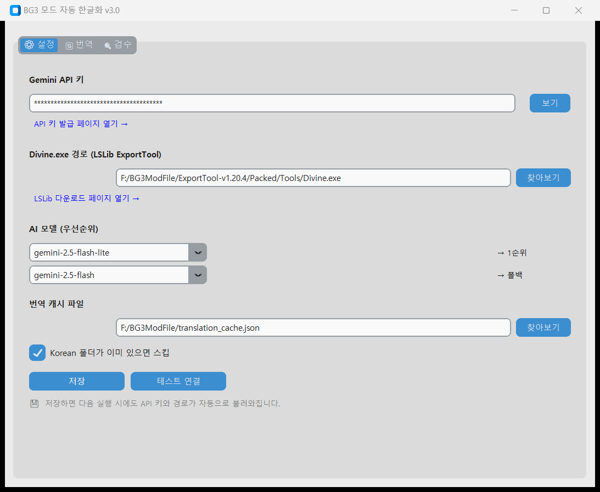
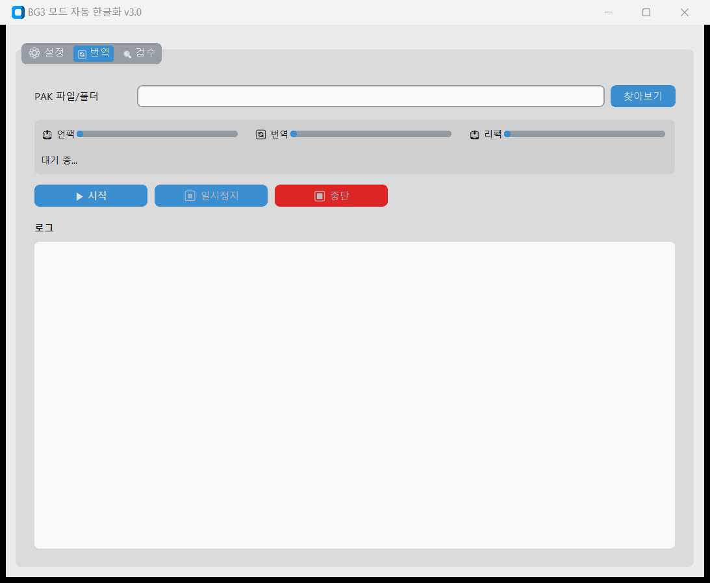
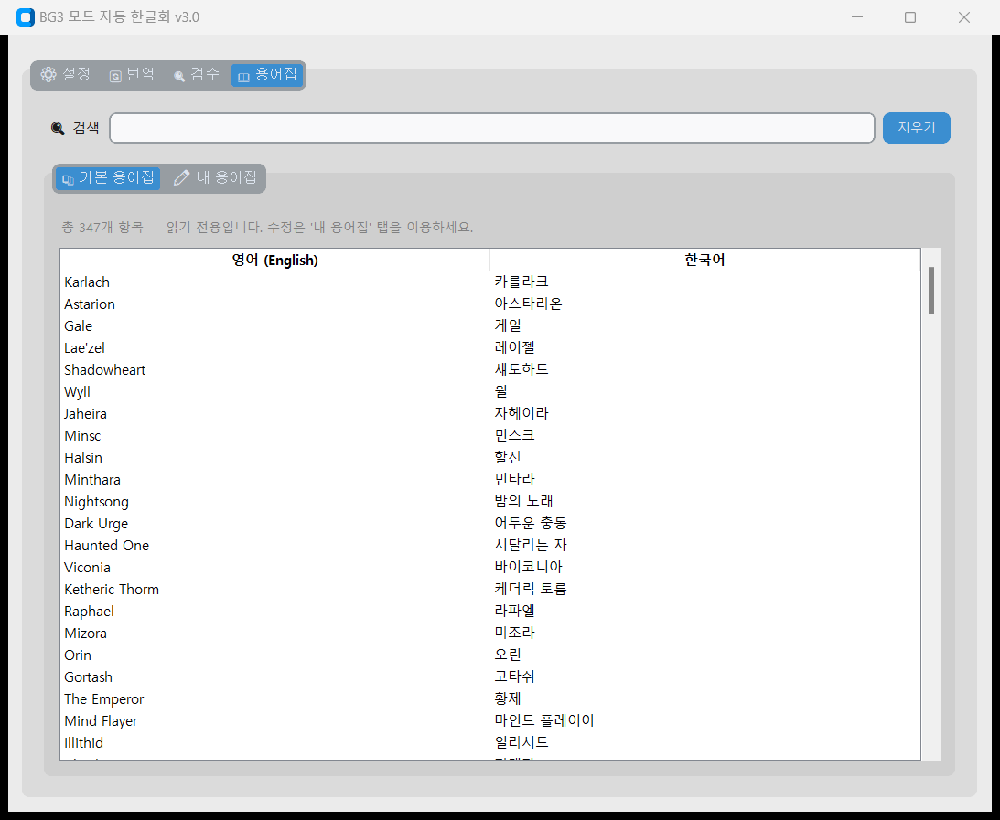
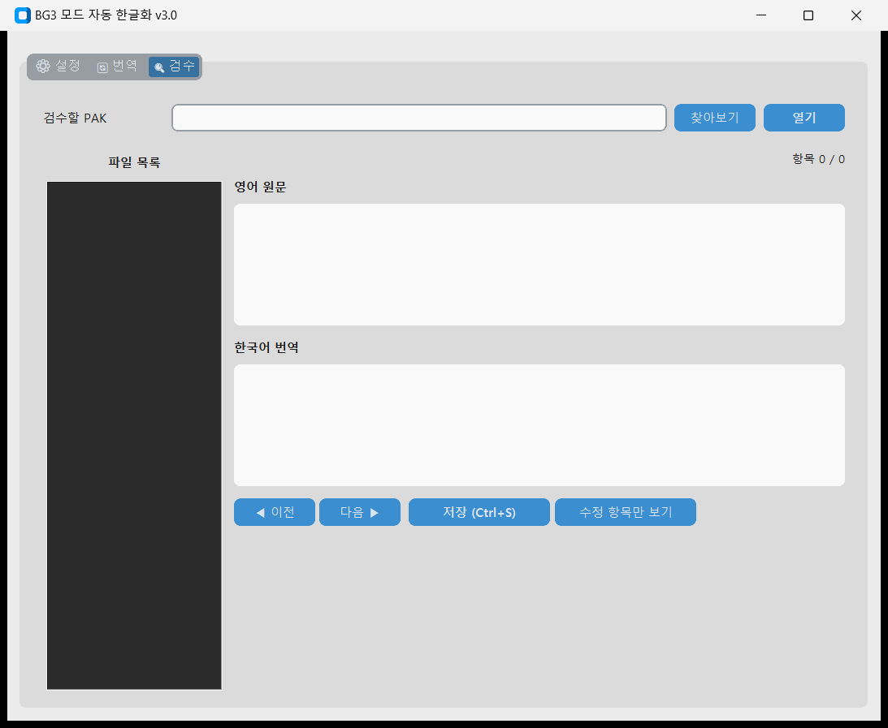

# BG3 모드 자동 한글화 도구 v3.6

발더스 게이트 3(Baldur's Gate 3) 모드의 텍스트를 Google Gemini AI로 자동 한국어 번역하는 도구입니다.
설치 필요 없이 **EXE 파일 하나**로 바로 사용할 수 있습니다.

---

## ⬇️ GUI 버전 다운로드

> **Python 설치 없이 바로 사용 가능한 EXE 버전입니다.**

### 👉 [BG3_AutoKorean_GUI.exe 다운로드](https://github.com/anboyu-alt/BG3-Auto-Korean/releases/latest)

릴리즈 페이지에서 `BG3_AutoKorean_GUI.exe` 를 클릭하면 즉시 다운로드됩니다.

---

## 목차

1. [준비물](#준비물)
2. [다운로드](#다운로드)
3. [첫 실행 — 설정하기](#첫-실행--설정하기)
4. [번역하기](#번역하기)
5. [용어집 관리하기](#용어집-관리하기)
6. [번역 검수하기](#번역-검수하기)
7. [번역 결과 게임에 적용하기](#번역-결과-게임에-적용하기)
8. [트러블슈팅](#트러블슈팅)
9. [자주 묻는 질문](#자주-묻는-질문)
10. [한글화의 원리](#한글화의-원리)
11. [고급 사용법 — CLI 모드](#고급-사용법--cli-모드)

---

## 준비물

EXE 파일을 실행하기 전에 아래 3가지를 먼저 준비해 주세요.

### 1. Gemini API 키 발급 (무료)

Google AI가 번역을 수행하기 위해 필요합니다. 발급은 무료입니다.

1. [aistudio.google.com](https://aistudio.google.com) 에 접속합니다 (Google 계정으로 로그인)
2. 왼쪽 메뉴에서 **"Get API key"** 를 클릭합니다
3. **"Create API key"** 버튼을 클릭합니다
4. 생성된 키 (`AIzaSy...` 로 시작하는 긴 문자열) 를 복사해 메모장에 저장해 둡니다

> ⚠️ API 키는 절대 타인에게 공유하지 마세요. 내 계정으로 API 사용량이 청구됩니다.

---

### 2. LSLib (ExportTool) 다운로드

`.pak` 파일을 풀고 다시 묶는 데 필요한 도구입니다.

1. [github.com/Norbyte/lslib/releases](https://github.com/Norbyte/lslib/releases) 에 접속합니다
2. 최신 버전의 **`ExportTool-vX.X.X.zip`** 을 클릭해 다운로드합니다
3. 다운로드한 `.zip` 파일의 압축을 풀어줍니다
4. 압축을 풀면 아래 구조로 파일이 생깁니다:
   ```
   ExportTool-v1.20.4/
   └── Packed/
       └── Tools/
           └── Divine.exe   ← 이 파일의 경로를 나중에 입력합니다
   ```

> 예시 경로: `C:\ExportTool-v1.20.4\Packed\Tools\Divine.exe`

---

### 3. .NET 8.0 런타임 설치

`Divine.exe` 실행에 필요합니다. 이미 설치되어 있으면 건너뛰세요.

1. [dotnet.microsoft.com/ko-kr/download/dotnet/8.0](https://dotnet.microsoft.com/ko-kr/download/dotnet/8.0) 에 접속합니다
2. **".NET Desktop 런타임"** 항목에서 **"x64"** 를 클릭해 설치 파일을 다운로드합니다
3. 설치 파일을 실행하고 안내에 따라 설치합니다

---

## 다운로드

1. 이 저장소의 **[Releases](../../releases)** 페이지로 이동합니다
2. 최신 릴리즈의 **Assets** 에서 `BG3_AutoKorean_GUI.exe` 를 클릭해 다운로드합니다
3. 원하는 폴더에 파일을 저장합니다 (어느 위치에 있어도 무관합니다)

> **Windows 보안 경고가 뜨면:** "추가 정보" → "실행" 을 클릭하면 됩니다.
> 코드 서명 인증서가 없어서 뜨는 경고이며, 실제 위험한 파일이 아닙니다.

---

## 첫 실행 — 설정하기

`BG3_AutoKorean_GUI.exe` 를 더블클릭해서 실행합니다.

처음 실행하면 아래와 같은 화면이 나타납니다:



> 📌 **스크린샷의 입력란에 값이 이미 들어있는 것은 예시입니다.**
> API 키, Divine.exe 경로, 캐시 파일 경로 모두 **본인의 값으로 새로 입력**해야 합니다.

### ① Gemini API 키 입력

`Gemini API 키` 입력란에 준비 단계에서 발급받은 API 키를 붙여넣습니다.

- 보안을 위해 기본적으로 `****` 로 가려집니다
- **"보기"** 버튼을 클릭하면 입력한 내용을 확인할 수 있습니다

### ② Divine.exe 경로 입력

`Divine.exe 경로` 입력란 오른쪽의 **"찾아보기"** 버튼을 클릭합니다.
파일 선택 창이 열리면 앞서 압축 해제한 폴더에서 `Divine.exe` 를 선택합니다.

> 예시: `C:\ExportTool-v1.20.4\Packed\Tools\Divine.exe`

### ③ AI 모델 선택

기본값 그대로 두셔도 됩니다. (기본값: `gemini-3.1-flash-lite`)

### ④ 번역 캐시 파일 경로 (선택 사항)

번역 캐시는 한 번 번역한 텍스트를 저장해두는 파일입니다.

- **비워두면 자동으로 기본 위치에 생성됩니다. 특별한 이유가 없으면 비워두세요**
- 기본 저장 위치: `C:\Users\사용자명\AppData\Roaming\BG3-Auto-Korean\translation_cache.json`
- 이 파일이 있으면 같은 텍스트를 다시 번역할 때 API를 호출하지 않고 저장된 결과를 바로 가져옵니다 → **번역 속도 향상 + API 사용량 절약**
- **절대 삭제하지 마세요.** 삭제하면 이전에 번역한 내용을 모두 잊고 처음부터 다시 번역합니다

### ⑤ 저장

**"저장"** 버튼을 클릭합니다.

> 💾 **저장하면 다음 실행 시에도 API 키와 경로가 자동으로 불러와집니다.**
> 한 번만 입력하면 이후에는 다시 입력할 필요가 없습니다.

저장 후 **"테스트 연결"** 버튼을 클릭해서 설정이 올바른지 확인할 수 있습니다.

---

## 번역하기

상단의 **"🔄 번역"** 탭을 클릭합니다.



### 번역 진행 순서

**1단계 — PAK 파일 또는 폴더 선택**

- **단일 파일**: `PAK 파일/폴더` 입력란 오른쪽 **"찾아보기"** 를 클릭해서 번역할 `.pak` 파일을 선택합니다
- **여러 파일**: `.pak` 파일들이 들어있는 **폴더 경로** 를 직접 입력하면 폴더 안의 모든 `.pak` 을 한 번에 번역합니다

> 모드를 다운로드하면 `.zip` 압축 파일 안에 `.pak` 파일이 들어있습니다.
> `.zip` 을 먼저 압축 해제한 뒤 `.pak` 파일을 선택하세요.

**2단계 — 시작**

**"▶ 시작"** 버튼을 클릭합니다.

번역이 시작되면:
- `📤 언팩` → `🔄 번역` → `📥 리팩` 순서로 진행률 바가 채워집니다
- 아래 로그 창에서 진행 상황을 실시간으로 확인할 수 있습니다
- 번역 완료 시 원본 `.pak` 과 같은 폴더에 **`_Korean.pak`** 파일이 생성됩니다

**번역 중 조작:**

| 버튼 | 동작 |
|------|------|
| ⏸ 일시정지 | 번역을 잠시 멈춥니다. 다시 클릭하면 재개됩니다 |
| ⏹ 중단 | 번역을 완전히 중단합니다 |

> **번역 시간:** 모드의 텍스트 양에 따라 다릅니다. 소규모 모드는 수 분, 대규모 모드는 수십 분이 걸릴 수 있습니다.

> **번역 캐시:** 한 번 번역한 텍스트는 자동으로 저장됩니다. 같은 텍스트가 다른 모드에도 있으면 API 호출 없이 캐시에서 바로 가져와 속도가 빠릅니다. 캐시 파일은 절대 삭제하지 마세요.

---

## 용어집 관리하기

상단의 **"📖 용어집"** 탭을 클릭합니다.



용어집은 AI 번역 시 반드시 따라야 할 고유 용어 목록입니다. 예를 들어 "Karlach"는 반드시 "카를라크"로, "Charisma"는 반드시 "매력"으로 번역하도록 강제합니다.

### 📚 기본 용어집 탭

총 347개의 BG3 고유 용어가 내장되어 있습니다 (캐릭터명, 능력치, 주문명, 종족, 직업, 상태이상 등).
읽기 전용입니다. 위쪽 검색창에 영어 또는 한국어를 입력하면 즉시 필터링됩니다.

### ✏️ 내 용어집 탭

모드 전용 고유명사 등을 직접 추가하고 관리할 수 있습니다.

| 버튼 | 동작 |
|------|------|
| + 추가 | 새 영어→한국어 항목 추가 |
| 수정 | 선택한 항목의 번역 수정 (더블클릭으로도 가능) |
| 삭제 | 선택한 항목 삭제 |
| 💾 저장 | 변경사항 저장 |

> ℹ️ **내 용어집이 기본 용어집보다 우선 적용됩니다.** 기본 용어집에 있는 단어를 다르게 번역하고 싶으면 내 용어집에 같은 영어 단어로 추가하면 됩니다.

> 내 용어집은 `C:\Users\사용자명\AppData\Roaming\BG3-Auto-Korean\custom_glossary.json` 에 저장됩니다.

---

## 번역 검수하기

AI 번역은 오역이 포함될 수 있습니다. 검수 탭에서 영어 원문과 한국어 번역을 나란히 비교하며 직접 수정할 수 있습니다.

상단의 **"🔍 검수"** 탭을 클릭합니다.



### 검수 진행 순서

**1단계 — 검수할 PAK 파일 선택**

`검수할 PAK` 입력란에서 **"찾아보기"** 로 번역이 완료된 `_Korean.pak` 파일을 선택합니다.

**2단계 — 열기**

**"열기"** 버튼을 클릭합니다. 파일이 자동으로 분석됩니다.

**3단계 — 항목 검수**

- 왼쪽 **파일 목록** 에서 검수할 파일을 선택합니다
- 위쪽 **"영어 원문"** 과 아래쪽 **"한국어 번역"** 을 비교합니다
- 번역이 틀렸으면 아래쪽 한국어 번역 박스를 직접 수정합니다

**4단계 — 저장**

**"저장 (Ctrl+S)"** 버튼을 클릭하면 수정된 내용이 반영된 새 `.pak` 파일이 생성됩니다.

**검수 화면 조작:**

| 버튼 / 단축키 | 동작 |
|------|------|
| ◀ 이전 / 다음 ▶ | 이전/다음 번역 항목으로 이동 |
| 저장 (Ctrl+S) | 수정된 내용을 저장하고 새 `.pak` 생성 |
| 수정 항목만 보기 | 내가 수정한 항목만 필터링해서 표시 |

---

## 번역 결과 게임에 적용하기

번역이 완료되면 원본 `.pak` 파일과 같은 폴더에 **`모드이름_Korean.pak`** 파일이 생성됩니다.

```
다운로드 폴더/
├── SomeMod.pak            ← 원본 (변경 없음)
└── SomeMod_Korean.pak     ← 한글화된 모드 ✅
```

이 `_Korean.pak` 파일을 BG3 모드 매니저로 설치하면 됩니다.

**BG3 Mod Manager 사용 시:**
1. `SomeMod_Korean.pak` **하나만** 모드 매니저로 드래그하거나 "Import Mod" 로 불러옵니다
2. 원본 모드(`SomeMod.pak`)는 **모드 매니저에 등록하지 않습니다** (한글화 PAK 안에 이미 원본 콘텐츠가 모두 들어 있습니다)
3. 게임 내 설정에서 언어를 **"한국어"** 로 변경합니다

> ⚠️ **반드시 파일명에 `_Korean` 이 붙은 PAK 하나만 등록하세요.**
> 원본 `.pak` 과 `_Korean.pak` 을 함께 등록하면 동일한 모드가 중복되어 충돌이 발생하거나 한국어가 제대로 적용되지 않습니다.
> 이 도구가 만드는 `_Korean.pak` 은 원본의 모든 파일에 한국어 번역만 추가한 **단독 완전 모드** 입니다.

---

## 트러블슈팅

### 프로그램이 실행되지 않아요

- Windows Defender가 차단한 경우: 파일을 우클릭 → "속성" → "차단 해제" 체크 후 확인
- 또는 파일 선택 시 뜨는 "Windows에서 PC를 보호했습니다" 창에서 "추가 정보" → "실행" 클릭

### "Divine.exe를 찾을 수 없습니다" 오류

- 설정 탭에서 Divine.exe 경로가 올바른지 확인합니다
- 경로 예시: `C:\ExportTool-v1.20.4\Packed\Tools\Divine.exe`
- LSLib를 다시 다운로드해서 압축 해제 후 경로를 재설정합니다

### Divine.exe 실행 시 오류가 납니다

- .NET 8.0 Desktop Runtime이 설치되어 있는지 확인합니다
- [dotnet.microsoft.com/ko-kr/download/dotnet/8.0](https://dotnet.microsoft.com/ko-kr/download/dotnet/8.0) 에서 재설치합니다

### "429 제한" 메시지가 뜹니다

- Gemini 무료 플랜의 분당 요청 한도입니다
- 스크립트가 자동으로 대기 후 재시도하므로 기다리면 됩니다
- 반복적으로 발생하면 설정 탭에서 AI 모델을 다른 것으로 변경해 보세요

### 번역이 완료됐는데 `_Korean.pak` 파일이 없어요

- 로그 창에서 오류 메시지를 확인합니다
- "번역할 Localization이 없거나 이미 완료됨" 메시지면 해당 모드에 번역 가능한 텍스트가 없는 것입니다
- 이미 `_Korean.pak` 이 있으면 자동으로 스킵됩니다. 기존 파일을 삭제 후 재시도하세요

### 한글화 모드를 등록했는데 동작이 이상하거나 충돌이 납니다

- 원본 `.pak` 과 `_Korean.pak` 을 **둘 다** 모드 매니저에 등록하지 않았는지 확인합니다
- `_Korean` 이 붙은 PAK 하나만 활성 상태로 두고, 원본 `.pak` 은 모드 매니저에서 제거하거나 비활성화합니다
- 한글화 PAK 은 원본의 모든 콘텐츠를 포함하므로 원본을 같이 등록하면 동일 모드가 중복되어 충돌합니다

### GUI 글씨가 너무 작거나 잘려 보여요 (고해상도 모니터)

- 4K 등 고DPI 모니터에서는 기본 글씨가 작아 보일 수 있습니다
- **설정 탭** → **UI 배율 (글씨 크기)** 콤보박스에서 `125%` ~ `200%` 중 선택 후 저장합니다
- 프로그램을 다시 실행하면 글씨와 버튼이 비례 확대되어 표시됩니다
- `자동 (모니터 DPI)` 옵션을 고르면 Windows 의 디스플레이 배율 설정을 따라갑니다

### 게임에 설치했는데 여전히 영어로 나와요

확인할 점:

1. **게임 언어 설정 미변경**: 게임 내 설정에서 언어를 "한국어"로 바꾸었는지 확인합니다
2. **원본 PAK과 한글본 PAK 동시 활성화**: 한글본은 원본 모드의 모든 콘텐츠를 포함한 **단독 완전 모드**입니다. BG3 Mod Manager 등에 원본 `.pak`과 `_Korean.pak`을 함께 등록하면 동일 UUID로 인식돼 한글본이 안 보일 수 있습니다. 원본은 비활성화하거나 다른 폴더로 옮기고 `_Korean.pak`만 활성화하세요.
3. **모드 매니저 캐시**: BG3 Mod Manager 등을 사용 중이라면 모드 목록을 "Refresh" 하거나 저장(Save Order) 후 게임을 완전히 종료했다가 다시 실행하세요.

### MCM(설정 메뉴) 안의 텍스트가 영어로 나와요

v3.5에서 MCM 의존 모드 자동 처리가 추가되었습니다. 그래도 일부 영어가 보이면:

1. **설정 탭에서 "MCM 의존 모드 자동 처리" 가 ON인지 확인**합니다 (기본 ON)
2. **산출 PAK을 새로 만드세요**: 이전 버전으로 만든 `_Korean.pak`이 모드 폴더에 남아 있으면 영어가 그대로일 수 있습니다. 모드 폴더와 작업 폴더에서 삭제 후 v3.5로 재처리합니다.
3. **콤보 박스 옵션이 영어**: `All`, `Vanilla`, `Hidden` 같은 짧은 단어는 클라이언트·서버 비교 키로 쓰이는 경우가 많아 안전을 위해 자동 처리에서 제외됩니다. 산출 PAK 옆 `<modname>_mcm_review.json`에 위치가 정리돼 있으므로 필요하면 수동으로 다듬을 수 있습니다.
4. **검수 큐 리포트**(`<modname>_mcm_review.json`)에 있는 항목들은 의도적으로 영어로 두는 항목입니다 (게임 동작 안전성 확보 목적)

### 번역 품질이 낮아요

- 검수 탭에서 직접 수정할 수 있습니다
- `bg3core/glossary.py` 파일에서 용어집을 추가/수정하면 번역 품질이 향상됩니다

---

## 자주 묻는 질문

**Q. 번역하면 원본 모드 파일이 변경되나요?**
아니요. 원본 `.pak` 파일은 절대 수정되지 않습니다. 새로운 `_Korean.pak` 파일이 별도로 생성됩니다.

**Q. API 사용 비용이 발생하나요?**
Gemini API는 무료 플랜으로도 충분히 사용 가능합니다. 다만 대용량 모드를 많이 번역하면 무료 한도를 초과할 수 있습니다. [Google AI Studio](https://aistudio.google.com) 에서 사용량을 확인할 수 있습니다.

**Q. 영어가 아닌 다른 언어 모드도 번역되나요?**
됩니다. 포르투갈어, 러시아어 등 어떤 언어든 한국어로 번역합니다.

**Q. 이미 번역한 모드를 다시 번역하고 싶어요**
기존 `_Korean.pak` 파일을 삭제하고 다시 시작 버튼을 클릭하세요.

**Q. 번역 캐시를 초기화하고 싶어요**
설정 탭에서 지정한 캐시 파일(`translation_cache.json`)을 삭제하면 됩니다. 단, 삭제하면 이전에 번역한 내용을 모두 다시 번역해야 하므로 API 사용량이 증가합니다.

**Q. 여러 모드를 한 번에 번역할 수 있나요?**
가능합니다. 번역 탭에서 `.pak` 파일 하나 대신 `.pak` 파일들이 들어있는 **폴더 경로** 를 입력하면 폴더 안의 모든 `.pak` 을 자동으로 찾아 순서대로 번역합니다.

---

## 한글화의 원리

BG3 모드의 텍스트는 모드 파일(`.pak`) 안에 아래와 같은 구조로 들어있습니다:

```
SomeMod.pak
└── Mods/
    └── SomeMod/
        └── Localization/
            └── English/
                └── SomeMod.xml   ← 영어 텍스트 파일
```

XML 파일 내부는 이런 형식입니다:

```xml
<content contentuid="h12345">This spell deals 2d6 fire damage.</content>
<content contentuid="h12346">Fireball</content>
```

**이 도구가 하는 일:**

```
.pak 언팩 → XML 파일 읽기 → Gemini AI 번역 → Korean 폴더에 저장 → 다시 .pak 으로 묶기
```

BG3는 게임 언어를 "한국어"로 설정하면 자동으로 `Korean` 폴더의 XML 파일을 읽습니다.

> **`.loca` 바이너리 형식 지원:** 일부 모드는 텍스트를 `.loca` 바이너리 형식으로 저장합니다. 이 도구는 `.loca` 파일을 자동으로 XML로 변환 후 번역하므로 별도 처리가 필요 없습니다.

> **`.loca` 바이너리 역생성 (v3.5~):** 표준 Localization 구조(`Localization/English/`, `Localization/Korean/` 등 언어 서브폴더가 있는 형태)를 가진 모드의 경우, 게임이 `.xml`이 아니라 `.loca` 바이너리에서 텍스트를 읽습니다. v3.5부터 한글화한 `.xml`을 `.loca`로 역변환해 PAK에 함께 포함시키므로 모든 모드에서 한글이 정확히 표시됩니다.

### MCM(Mod Configuration Menu) 의존 모드 한글화 — v3.5 신규

[BG3MCM](https://github.com/AtilioA/BG3-MCM)에 의존하는 모드는 표준 Localization XML 외에도 다음 위치에 텍스트가 분산됩니다:

1. **`Mods/<modname>/MCM_blueprint.json`** — 설정 메뉴의 탭/섹션/항목 이름·설명·툴팁
2. **`Mods/<modname>/ScriptExtender/Lua/*.lua`** — IMGUI 위젯 라벨, 콤보 옵션 등

v3.5는 두 곳을 자동 감지·처리합니다. 설정 탭의 **"MCM 의존 모드 자동 처리 (블루프린트·Lua)"** 토글로 켜고 끌 수 있으며 기본값은 ON입니다.

**처리 흐름:**

- **블루프린트 평문 필드** — `ModName`, `TabName`, `SectionName`, `Name`, `Description`, `Tooltip`, `Label`, `Choices` 등을 한글로 직접 치환합니다. 단, 같은 노드에 `NameHandle`/`DescriptionHandle`/`TooltipHandle`/`LabelHandle` 같은 `Handles`가 정의돼 있으면 건드리지 않고 Localization XML 측 번역에 맡깁니다(게임은 핸들 기반 텍스트를 우선 사용).

- **Lua IMGUI 호출** — `:AddText(...)`, `:AddButton(...)`, `:AddCollapsingHeader(...)`, `:AddInputText(label, init)`, `.Hint = "..."`, `.Text = "..."`, `string.format("...", ...)` 첫 인자의 문자열 리터럴을 자동으로 추출·번역·치환합니다.

- **자동 처리 제외(검수 큐로 분리)** — 다음은 게임 동작을 깨뜨릴 위험이 있어 자동 처리하지 않고 산출 PAK 옆 `<modname>_mcm_review.json`에 위치(파일·줄 번호)와 함께 보고합니다:
    - IMGUI 내부 ID(`##ItemCount` 등 `##`으로 시작)
    - 네트워크 채널 이름(`Foo_BarBaz` 패턴)
    - IMGUI 색상 슬롯(`Text`, `Button`, `FrameBg` 등)
    - 파일 확장자(`.json`, `.lua` 등)
    - 비교 키로 자주 쓰이는 짧은 단어(`All`, `Vanilla`, `Hidden`, `Edited`, `Root`, `Local`, `On Hover`, `Alt-Highlight` 등 약 27종)

- **콤보 옵션 배열** — `combo.Options = { "A", "B" }` 형태는 클라이언트·서버 간 비교 키로도 사용돼 자동 치환 시 필터 동작이 깨질 수 있어 모두 검수 큐로 보냅니다.

- **`string.format` 포맷 보존** — `"Showing %d / %d items"` 같은 포맷 문자열은 번역 결과에서 `%d`, `%s` 등의 specifier가 보존됐는지 검증해, 깨졌으면 치환하지 않고 원문을 유지합니다(게임 크래시 방지).

- **비표준 평면 Localization** — `Localization/Test.xml`처럼 언어 서브폴더 없이 평면 구조를 사용하는 모드(예: Tooltip Manager)도 자동 감지해 in-place로 한글화합니다.

- **다국어 폴더 미러** — 한글본을 만든 뒤 동명 파일이 존재하는 영어/프랑스어 등 다른 언어 폴더에도 한글을 복사합니다. 일부 BG3MCM이 게임 언어 설정과 무관하게 영어 폴더의 XML만 읽는 경우에 대비한 안전장치입니다.

> 검수 큐 리포트 `<modname>_mcm_review.json`은 자동 처리에서 제외된 항목 목록을 제공합니다. 필요하면 직접 편집해 라벨 맵을 작성하거나 추가 한글화 작업의 기준으로 사용할 수 있습니다.

---

## 고급 사용법 — CLI 모드

Python이 설치되어 있다면 EXE 없이 스크립트를 직접 실행할 수 있습니다.

### 환경 준비

```bash
pip install customtkinter pillow
```

### 스크립트 파일

| 파일 | 설명 |
|------|------|
| `BG3_AutoKorean_PAK_v2.2.py` | PAK 직접 번역 (터미널) |
| `BG3_AutoKorean_Reviewer_v2.2.py` | 터미널 기반 검수 도구 |
| `BG3_AutoKorean_Folder_v2.2.py` | ⚠️ Deprecated — GUI 번역 탭 사용 권장 |
| `bg3_autokorean_gui.py` | GUI 실행 진입점 |

### 실행

```bash
# GUI 실행
python bg3_autokorean_gui.py

# 터미널 PAK 번역
python BG3_AutoKorean_PAK_v2.2.py

# 터미널 검수 도구
python BG3_AutoKorean_Reviewer_v2.2.py
```

`BG3_AutoKorean_PAK_v2.2.py` 를 메모장으로 열어 `[설정 구간]` 을 수정해 API 키와 경로를 입력할 수 있습니다.

### 용어집 수정

`bg3core/glossary.py` 에서 고유명사 번역을 추가하거나 수정할 수 있습니다:

```python
GLOSSARY = {
    "Karlach": "카를라크",
    "Elminster": "엘민스터",
    # 여기에 추가
    "MyModCharacter": "내 모드 캐릭터",
}
```

### EXE 직접 빌드

```bash
pip install pyinstaller
python -m PyInstaller bg3_autokorean_gui.spec
# 결과물: dist/BG3_AutoKorean_GUI.exe
```

---

## 업데이트 이력

### v3.6
- **번역 결과 XML 깨짐 자동 복구**: spell·passive 설명이 많은 모드(예: The Viltrumite Race, DBW DragonBall Warrior 등)에서 Gemini가 D&D 용어를 한글로 옮기며 `<내성 굴림>` 같은 자작 placeholder를 raw `<>`로 결과에 포함시키는 경우가 있었습니다. 이렇게 escape 안 된 angle bracket이 `<content>...</content>` 안에 들어가면 XML 구조가 깨지고 `divine`의 `.loca` 변환이 실패해 게임에서 한글이 표시되지 않았습니다. 이제 번역 직후 자동으로 raw `<`/`>`를 `&lt;`/`&gt;` entity로 변환합니다 (원본의 `&lt;LSTag .../&gt;` 같은 valid entity는 그대로 보존).
- **Gemini 시스템 프롬프트 보강**: 번역 결과에 `<...>` 형태의 새 태그나 placeholder를 만들지 않도록 규칙 추가. D&D 용어는 일반 괄호로만 표기하도록 명시.
- **`.loca` 변환 실패 시 진단 로그**: divine의 stderr를 로그에 표시해 다음 진단을 쉽게.
- 단위 테스트 6건 추가(`tests/test_xml_escape.py`).

### v3.5.2
- **미러를 prefix 기반으로 확장**: 원본 PAK에 `english.xml`과 `english.loca`가 모두 들어있는 모드(DBW DragonBall Warrior, The Viltrumite Race 등)는 추출 후 영어 폴더에 `english.xml`과 `english.loca.xml`이 공존합니다. v3.5.1까지의 미러는 같은 **이름** 파일만 덮어써서 `english.loca.xml`은 영문 그대로 남았고, `.loca` 역변환 시 영문 결과가 게임에 적용되는 케이스가 발생했습니다. 이제 베이스 prefix(`english`) 기반 매칭으로 영어 폴더의 `english.xml`·`english.loca.xml`을 한 번에 모두 한글로 덮어씁니다.

### v3.5.1
- **`.loca` 역변환 누락 수정**: 일부 모드(DBW DragonBall Warrior, The Viltrumite Race 등)는 Localization 폴더에 `*.loca.xml`이 아닌 그냥 `english.xml` 이름을 사용합니다. v3.5는 `*.loca.xml` 패턴만 변환했기 때문에 이런 모드는 `.loca` 바이너리가 생성되지 않아 게임에서 한글이 표시되지 않았습니다. 이제 `Localization/` 안의 모든 `.xml`을 `.loca`로 역변환합니다.

### v3.5
- **MCM(Mod Configuration Menu) 의존 모드 자동 처리**:
    - `MCM_blueprint.json` 평문 필드(`ModName`, `TabName`, `SectionName`, `Name`, `Description`, `Tooltip`, `Label`, `Choices` 등) 자동 번역. `Handles`로 보호된 필드는 건드리지 않고 Localization XML 처리에 위임.
    - `ScriptExtender/Lua/*.lua` 안의 IMGUI 위젯 호출(`:AddText`, `:AddButton`, `:AddCollapsingHeader`, `:AddInputText`, `.Hint`, `.Text`, `string.format`) 문자열 리터럴 자동 치환.
    - 코드 식별자성 문자열(IMGUI ID `##...`, 네트워크 채널, 색상 슬롯, 파일 확장자)과 비교 키 짧은 단어(`All`, `Vanilla`, `Hidden` 등) 자동 처리 제외 → 산출 PAK 옆 `<modname>_mcm_review.json` 검수 리포트 생성.
    - 콤보 옵션 배열(`Options = { ... }`)은 클라이언트·서버 비교 키 보호 차원에서 검수 큐로 분리.
    - `string.format` 포맷 specifier(`%d`, `%s` 등) 보존 검증으로 깨진 번역은 자동 거부.
    - 비표준 평면 Localization(`Localization/Test.xml`) 구조 자동 인식·in-place 한글화.
    - 한글본을 동명 파일이 있는 다른 언어 폴더(English, French 등)에 미러링.
- **`.loca` 바이너리 역생성**: 한글화한 `.loca.xml`을 `.loca` 바이너리로 역변환해 PAK에 함께 포함. 표준 Localization 구조 모드(BG3가 `.loca`만 읽는 경우)에서 한글이 정확히 표시되도록 보장.
- **설정 탭에 "MCM 의존 모드 자동 처리" 토글 추가**(기본 ON).
- 번역 응답 파싱 안전성 강화: 텍스트 안의 `|` 문자가 `idx|content` 형식과 충돌하지 않도록 placeholder로 보호 후 복원.
- 단위 테스트 28개 추가(`tests/test_mcm_*.py`, `tests/test_patch_builder.py`).
- 진단 도구 추가: `tests/diagnose_korean_output.py`(산출물의 영문 잔존을 카테고리별로 분류), `tests/smoke_check.py`.

### v3.1
- **용어집 탭 추가**: 기본 용어집(347개) 검색 + 내 용어집(커스텀) 직접 추가·수정·삭제
- **고해상도 모니터 대응**: 설정 탭에 UI 배율 옵션 추가 (자동 / 100% / 125% / 150% / 175% / 200%)
- Windows DPI awareness 활성화로 흐림 현상 개선

### v3.0
- **GUI 버전 추가**: EXE 파일 하나로 Python 없이 바로 사용 가능
- **번역 탭**: PAK 파일 선택 → 시작/일시정지/중단 버튼, 실시간 진행률 및 로그
- **설정 탭**: API 키, Divine.exe 경로를 GUI에서 입력하고 저장
- **검수 탭**: 파일 트리 + 원문/번역 나란히 표시 + 저장
- Gemini 모델 업데이트: `gemini-3.1-flash-lite` (1순위), `gemini-2.5-flash-lite` (폴백)
- BG3 Modder's Multitool 의존성 제거 (Divine.exe 직접 호출로 일원화)

### v2.2
- `.loca` 바이너리 형식 자동 변환 지원 (PAK 모드)
- XML 파일 미발견 시 진단 메시지 추가

### v2.1
- 번역 검수 도구 추가

### v2.0
- PAK 직접 모드 추가 (Divine.exe 기반 전자동 처리)
- 번역 캐시, 용어집 350개+ 확장

---

## 주의사항

- 번역 결과는 AI가 생성한 것이므로 오역이 포함될 수 있습니다
- 원본 모드 파일은 절대 수정되지 않습니다
- API 키를 인터넷이나 타인에게 공유하지 마세요
- **`translation_cache.json` 파일을 삭제하지 마세요.** 이전 번역 내용을 기억해두는 파일로, 삭제하면 모든 텍스트를 처음부터 다시 번역하게 됩니다
